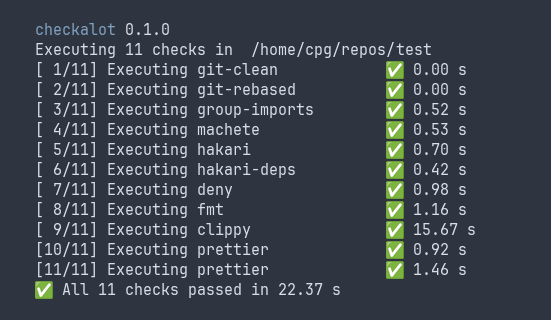
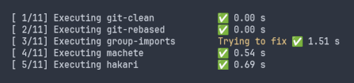

# checkalot

This lightweight binary runs a configurable series of commands that can perform checks on a repository, such as linting or formatting. Automatic fixing can be attempted for commands that support it.




## Usage

```
Usage: checkalot [OPTIONS] [REPOSITORY]

Arguments:
  [REPOSITORY]  [default: deduced from current directory]

Options:
      --fix   Tries to fix errors
  -h, --help  Print help
```

The repository should contain a `checkalot.yaml` configuration file at its root; an example can be found at the root of the repository.

```yaml
checks:
  # Built-in command
  - type: git-is-clean
  # Built-in command
  - type: git-is-rebased
  # Custom command
  - type: command
    # Name, only for display
    name: group-imports
    command: cargo group-imports
    # Folder relative to the repository where to excute the command
    folder: rust
    # Optional command for --fix flag
    fix_command: cargo group-imports --fix
```

When the `--fix` command is provided the `fix_command` command of each failed check is called, before re-executing the check.

## Installation

```
$ cargo install --git https://github.com/cpg314/checkalot --tag v0.1.1
```

This will install both `checkalot` and `cargo-checkalot`, the latter being usable as a cargo subcommand (`cargo checkalot`).

If emojis do not show properly, install a failback font such as [Noto Emoji](https://github.com/googlefonts/noto-emoji). For example, on Arch/Manjaro with wezterm:

```console
$ sudo pacman -S noto-fonts-emoji
$ rg font ~/.wezterm.lua
font = wezterm.font_with_fallback({"JetBrains Mono", "Noto Emoji"})
```

## See also

- https://crates.io/crates/cargo-checkmate
- The commands featured in the example:
  - https://github.com/bnjbvr/cargo-machete
  - https://github.com/EmbarkStudios/cargo-deny
  - https://crates.io/crates/cargo-hakari
  - https://prettier.io/
  - https://github.com/cpg314/cargo-group-imports
